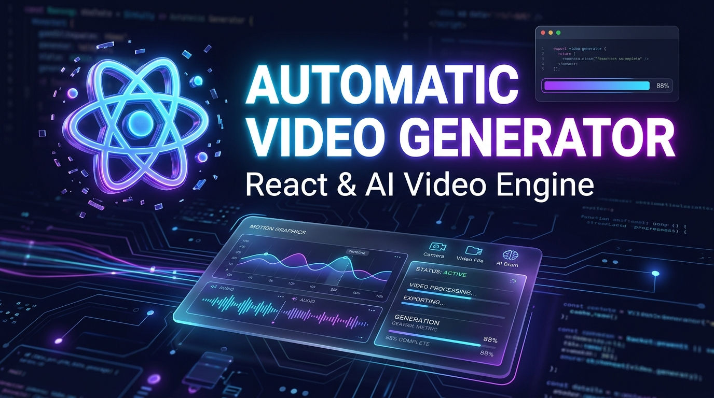
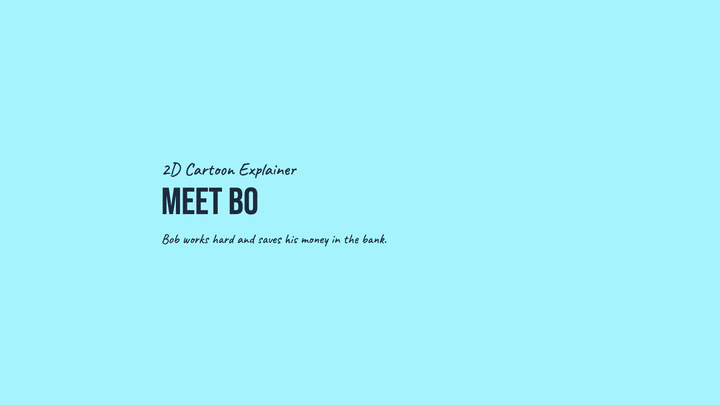
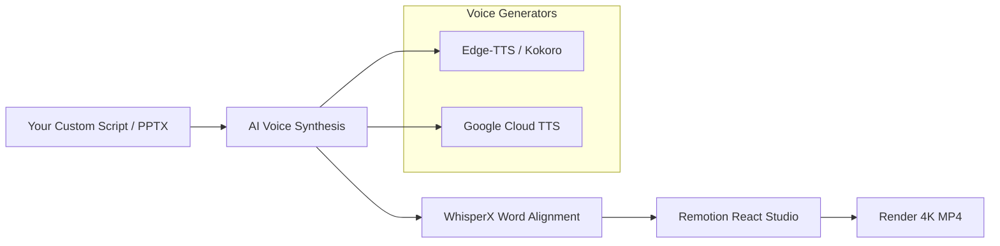

<p align="center">
  <h1 align="center">🎬 Automatic Video Generator</h1>
  <p align="center">
    <strong>Open-Source Programmatic AI Video Engine & Motion Studio</strong>
  </p>
  <p align="center">
    Built with <strong>Remotion (React 19)</strong>, <strong>TypeScript</strong>, <strong>Python TTS (Edge-TTS / Kokoro)</strong> & <strong>WhisperX</strong> alignment.
  </p>
</p>

<p align="center">
  <a href="https://github.com/remotion-dev/remotion"></a>
  <a href="https://react.dev"></a>
  <a href="https://www.typescriptlang.org"></a>
  <a href="./LICENSE"></a>
  <a href="https://github.com/johnvictorpaul95/automatic-video-generator/stargazers"></a>
</p>

<p align="center">
  
</p>

<p align="center">
  
</p>

---

## 🌟 What is Automatic Video Generator?

**Automatic Video Generator** is an open-source **React-based AI video engine & toolkit** designed for developers and content creators to programmatically build their own 4K videos. It combines component-driven motion graphics with AI voice synthesis (Edge-TTS, Kokoro, Google TTS), WhisperX word-level timestamp alignment, automated B-roll scraping, and dynamic data visualization components.

Rather than a static video player, **Automatic Video Generator is a complete builder framework**: you define scripts, customize themes, add visual components, and render high-quality videos automatically from code.

---

## 🛠️ How to Build Your Own Custom Video

Creating your own video takes just 3 steps:

### Step 1: Write Your React Composition (`src/MyCustomVideo.tsx`)

```tsx
import { AbsoluteFill, Sequence } from 'remotion';
import { KineticTypography } from './components/KineticTypography';
import { LineChartAnimation } from './components/DataVisualizations';

export const MyCustomVideo = () => {
  return (
    <AbsoluteFill style={{ backgroundColor: '#0f172a' }}>
      <Sequence from={0} durationInFrames={150}>
        <KineticTypography text="BUILD YOUR OWN AI VIDEOS IN REACT" />
      </Sequence>
      <Sequence from={150} durationInFrames={200}>
        <LineChartAnimation data={[10, 45, 95, 230]} label="REVENUE GROWTH" />
      </Sequence>
    </AbsoluteFill>
  );
};
```

### Step 2: Register in `src/Root.tsx`

```tsx
<Composition
  id="MyCustomVideo"
  component={MyCustomVideo}
  durationInFrames={350}
  fps={30}
  width={1920}
  height={1080}
/>
```

### Step 3: Render Your Video to MP4

```bash
npx remotion render MyCustomVideo rendered/my_custom_video.mp4
```

---

## ✨ Features & Modules

| Module | Description |
| :--- | :--- |
| 🧩 **Modular Motion UI Library** | Glowing HUDs, kinetic text overlays, financial charts, split-screens, & drifting camera frames. |
| 🎙️ **Plug-and-Play AI Voice Engine** | Python scripts for Edge-TTS (free neural voices), Kokoro-82M (local neural), & Google TTS. |
| ⏱️ **WhisperX Auto-Alignment** | Word-level timestamp synchronization for subtitle overlays & kinetic text sync. |
| 📄 **PowerPoint-to-Video Engine** | Automatically parse `.pptx` slides, extract speaker notes, synthesize voiceover & build videos. |
| 🎬 **25+ Starter Compositions** | Example compositions (Documentaries, Tech Demos, Financial Reports, Cartoons) to clone & customize. |

---

## 🏗️ Architecture Pipeline



---

## 🚀 Quick Start

### Prerequisites

- **Node.js** v18+ and **npm** / **pnpm**
- **Python 3.10+** (optional: for AI voice generation & WhisperX subtitle alignment)
- **ffmpeg** installed on system path

### 1. Clone & Install Dependencies

```bash
git clone https://github.com/johnvictorpaul95/automatic-video-generator.git
cd automatic-video-generator
npm install
```

### 2. Launch Remotion Studio (Visual Editor)

```bash
npm run dev
```

Open `http://localhost:3000` in your browser to interactively edit, scrub timelines, tweak animations, and preview compositions in real-time.

### 3. Generate Audio for Your Script (Optional)

```bash
# Generate AI Voiceover from text
python generate_unseen_vo.py

# Align subtitles with WhisperX
python transcribe_align.py --audio voiceover.mp3
```

### 4. Render to 4K MP4

```bash
npx remotion render MyCustomVideo rendered/output.mp4 --overwrite
```

---

## 🛠️ Project Structure

```
automatic-video-generator/
├── src/
│   ├── components/         # Reusable Motion Graphics, Kinetic Text, Charts, HUDs
│   ├── Root.tsx            # Main Composition Registry & Configurations
│   ├── USDebtUltra.tsx     # Vox-style Documentary Template
│   ├── IranNuclearTalks.tsx# Kinetic Typographic Geo-political Template
│   ├── PPTVideoPremium.tsx # PowerPoint-to-Video Engine
│   └── studio.ts           # Remotion Studio Entrypoint
├── pipeline/               # Automation scripts for asset generation
├── docs/                   # Full documentation & guides
├── fetch_broll.ts          # Automated Stock Video / Image Scraper
├── generate_unseen_vo.py   # Edge-TTS / Kokoro Voice Synthesis Pipeline
└── transcribe_align.py     # WhisperX Word-Level Timestamp Alignment
```

---

## 📈 Interactive Browser Previews

Launch fast, lightweight HTML preview dashboards without starting a full render server:

- Open [`youtube_policy_dash_preview.html`](./youtube_policy_dash_preview.html) in your browser for a live UI breakdown.
- Open [`chatgpt_demo_preview.html`](./chatgpt_demo_preview.html) for an interactive component demo.

---

## 🤝 Contributing

Contributions, issues, and feature requests are welcome! Feel free to check out the [issues page](https://github.com/johnvictorpaul95/automatic-video-generator/issues).

1. Fork the Project
2. Create your Feature Branch (`git checkout -b feature/AmazingFeature`)
3. Commit your Changes (`git commit -m 'Add some AmazingFeature'`)
4. Push to the Branch (`git push origin feature/AmazingFeature`)
5. Open a Pull Request

---

## 📜 License

Distributed under the **MIT License**. See [`LICENSE`](./LICENSE) for more information.

---

<p align="center">
  Built with ❤️ for creators, developers, and open-source enthusiasts. Give it a ⭐️ if you find it useful!
</p>
